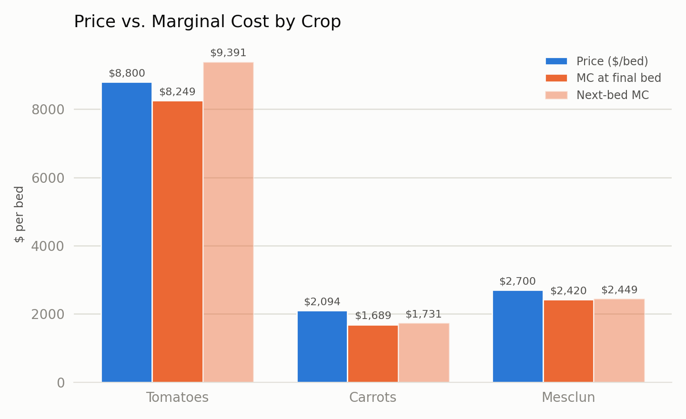
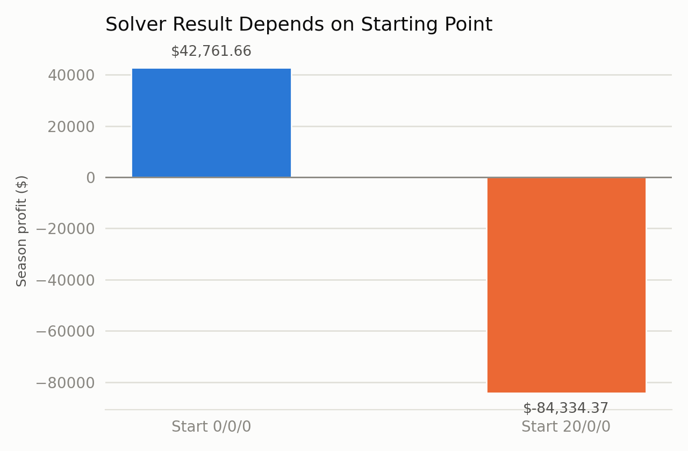

# Perfect Competition — Marginal Analysis Findings

## Optimal Mix and Profit

The model landed on 10 tomato beds, 20 carrot beds, and 30 mesclun beds, for a total of 60 beds out of the 64 available. The projected profit was $42,761.66. It used all 4 available temporary workers, out of the 4 allowed.

## Price = Marginal Cost, By Crop

**Tomatoes.** The model stops at 10 tomato beds because the 10th bed costs about $8,249, which is still below the $8,800 selling price. But the 11th bed would cost about $9,391, which is more than the price. That means the extra bed would cost more than it brings in, so the model makes more profit by stopping at 10.

**Carrots and mesclun.** Carrots and mesclun stopped because they reached their maximum allowed beds, not because they became too expensive to grow. The 20th carrot bed and the 30th mesclun bed both cost less than their selling prices, so they could still bring in more profit. Unlike tomatoes, where the 11th bed would cost more than it earns, carrots and mesclun could still be worth expanding if the model allowed more beds.

Figure 1 compares the selling price of each crop with its marginal cost (MC) per bed. Notice which MC bars are below the price bars, meaning those beds are still profitable, and which MC bars rise above the selling price, meaning those additional beds would reduce profit.

## Binding vs. Slack Constraints

- **Carrot cap:** The carrot constraint is binding because the model used all 20 of 20 available beds.
- **Mesclun cap:** The mesclun constraint is binding because the model used all 30 of 30 available beds.
- **Tomato cap:** The tomato constraint is slack because the model used only 10 of 20 available beds, leaving 10 beds unused.
- **Total beds:** The total bed constraint is slack because the model used 60 of 64 available beds, leaving 4 beds unused.
- **Temporary workers:** The temporary worker constraint is not binding because, although the model uses all 4 of 4 worker slots, it only needs about 4,557 of the 5,760 available hours, and adding a fifth worker would not increase profit.

The farm should consider increasing the carrot bed limit first because one additional carrot bed could increase profit by about $352.49, compared with $246.47 for one more mesclun bed. Adding another total bed or hiring a fifth temporary worker would add $0 in profit because the farm already has enough total bed capacity and temporary labor hours to support its current best planting mix. Therefore, relaxing the carrot and mesclun limits would provide the greatest opportunity to increase profit.

## Why Does Tomato Marginal Cost Dip?

Between beds 5 and 6, the farm uses up the owner's 720 available labor hours and starts relying on temporary workers, who have a lower hourly rate. Even though the extra labor increases from 197.7 to 231.9 hours, the marginal cost drops from $7,661 to $4,906 because more of the labor is priced at the lower temporary-worker rate.

## Why Grow a Crop That Looks Unprofitable?

Even though carrots and mesclun lose money when each crop has to cover the entire $20,000 fixed cost on its own, it still makes sense to grow them because their selling prices are higher than their marginal costs, so the additional beds contribute to the farm's profit. Their prices are also above their average variable costs (AVC), which means they cover the costs of producing the crops and contribute something toward fixed costs. The farm still has to pay the $20,000 fixed cost whether it grows these crops or not, so growing them helps cover that expense instead of leaving the farm to absorb the full cost without their revenue.

## Solver Reliability

I checked the Solver results using two different starting points to see whether the model would find the same solution. Starting at 0/0/0 gave me a profit of $42,761.66 with 10 tomato, 20 carrot, and 30 mesclun beds. Starting at 20/0/0 gave me a much lower profit of -$84,334.37. This showed that Solver was not consistently finding the best solution. I will test Solver with different starting points and independently verify the profit and constraints before accepting the results.

Figure 2 compares the results from two different Solver starting points, showing that they can lead to different outcomes. The key takeaway is that Solver may not always find the same best solution, so the results should be checked by testing different starting points and verifying the final profit and crop mix.

## Comparison to Stage 1 Hypothesis

In my Stage 1 brief, I predicted a planting mix of 15 tomato, 19 carrot, and 30 mesclun beds. The model found a better mix of 10 tomato, 20 carrot, and 30 mesclun beds, so my estimate was off on tomatoes and carrots. One of my own tests was whether the model would use fewer than 12 tomato beds, and that test was met because it only planted 10. I also identified keeping carrots at 20 beds as evidence that my estimate was wrong, and the model reached that limit. I think I underestimated how quickly tomato marginal cost would rise above the selling price, so I expected the farm could profitably grow more tomatoes than the model supported. This showed me that my initial estimate was reasonable as a starting point, but I needed to rely more on the marginal-cost calculations than on my first assumptions.
